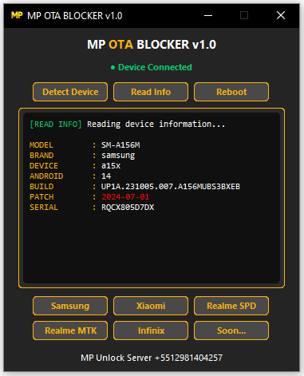
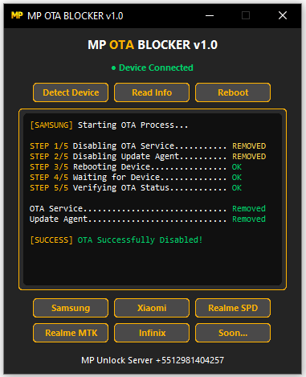

# MP OTA BLOCKER

## Professional Android OTA Blocker

Supports **Samsung, Xiaomi, Realme (SPD & MTK)** and **Infinix/Tecno** devices.

## Features

- ✅ Automatic Device Detection
- ✅ Read Device Information
- ✅ OTA Verification
- ✅ Fast ADB Communication
- ✅ Lightweight Standalone Executable
- ✅ Modern & Intuitive Interface
- ✅ One-Click Operation
- ✅ No Installation Required

## Read Device Information

Displays essential device information including:

- Model
- Brand
- Android Version
- Build Number
- Security Patch
- Serial Number

## OTA Verification

Verifies whether OTA packages have been successfully removed or disabled after the process.

## Why Choose MP OTA BLOCKER?

Automatic firmware updates can restore patched security features, interfere with **FRP services**, **MDM removal**, **PayJoy bypasses**, and other maintenance procedures.

MP OTA BLOCKER helps technicians maintain complete control over device software, reducing the risk of unexpected OTA updates while providing a fast and reliable workflow.

## Supported Brands

- Samsung
- Xiaomi
- Realme (SPD)
- Realme (MTK)
- Infinix / Tecno

More manufacturers will be added in future updates.

---

## Version

**MP OTA BLOCKER v1.0**

Developed by **MP Unlock Server**
